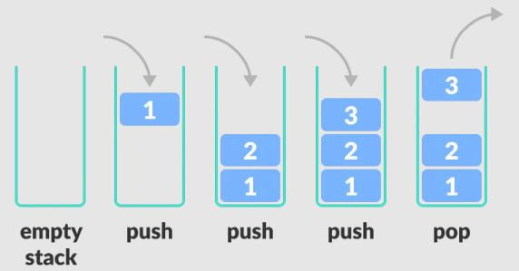
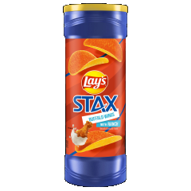

# Abstract Data Types (Practice)

###### ICS4U - Mr. Brash 🐿️

In [the script file](script.js) you will find a simple example ADT that represents a person. Take a look at the syntax and how it is structured. Feel free to test using it with some quick sample code and ask if there is anything you do not understand.

## Your Task:

A [stack](https://en.wikipedia.org/wiki/Stack_(abstract_data_type)) is an [abstract data type](https://en.wikipedia.org/wiki/Abstract_data_type) that we call **L**ast **I**n **F**irst **O**ut (LIFO). It is a well-known ADT in computer science.

<br>
[Here is another visual representation of pushing and popping](https://en.wikipedia.org/wiki/Stack_(abstract_data_type)#/media/File:Lifo_stack.svg).

A [Stack](https://en.wikipedia.org/wiki/Stack_(abstract_data_type)) employs the following properties and functions:

- `contents[]`: the contents of the stack, typically hidden - more on that in a future lesson,
- `push()`: add an element to the collection,
- `pop()`: remove (and return) the most recently added element - the element on the _top_ of the stack,
- `peek()`: return the most recently added element _without removing it from the stack_,
- `is_empty()`: check if the stack is empty (returns true/false)

**Note:** we are simplifying our lives by using an *array* for the `contents`. Typically this is [a linked list](https://simple.wikipedia.org/wiki/Linked_list) and we can only see the "head" node.

---

**When might this data structure be useful?**

There are _many_ uses:

**Reversing a string or chain** - Put all the letters in a stack and pop them out. Because of the LIFO order of stack, you will get the letters in reverse order.

**Web browsers** - The back button in a browser saves all the URLs you have visited previously in a stack. Each time you visit a new page, it is added on top of the stack. When you press the back button, the current URL is removed from the stack, and the previous URL is accessed.

**Code compilers** - Compilers use the stack to calculate the value of expressions like 2 + 4 / 5 * (7 - 9) by converting the expression to prefix or postfix form.


# Your Task:
Implement the `Stack` ADT in JavaScript, as described above.<br>**Note:** in a perfect world, the `contents` would be hidden and not directly accessible. We will talk about this more in a future lesson.

Once your `Stack` is complete:
- Create a function (outside the Stack ADT code) called `reverse_string(str)`. This function will *use* the Stack to *return* the given string `str` in reverse. **For Example:**
  ```JS
  reverse_string("Hello World!");
  > '!dlroW olleH'
  ```

- create a function (outside the Stack ADT code) called `reverse_number(n)`. This function will use the Stack to *return* a *number* in reverse order. If done correctly, all data will *remain* a *number* and you will **not** convert to strings.<br> **For Example:**
  ```JS
  reverse_number(87631);
  > 13678
  ```

  Note - the return value of `reverse_number()` must be *a number* (type: `number`), not a string.

<br>

<div style="text-align:center"><h3>Happy Coding! 🐿️</h3></div>


---

<br><br>
